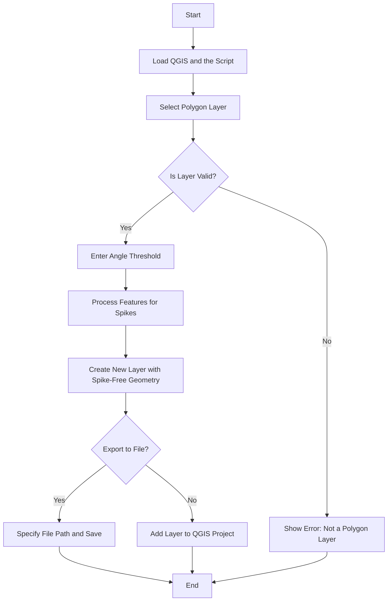

# Unspike gpkg (QGIS script version)

## Overview

`unspike.py` is a QGIS Python script designed to detect and remove sharp spikes from polygon layers. The script prompts the user to select a layer containing polygons or multipolygons, specifies an angle threshold for spike detection, and generates a new layer with the spike-free geometry. Users can choose to save the new layer as a GeoPackage file or simply add it to the current QGIS project.

## Features

- **User Interface**: Prompts the user to select a polygon layer and specify an angle threshold.
- **Spike Detection and Removal**: Uses a geometric algorithm to identify and remove sharp spikes in polygons.
- **Flexible Output**: Allows users to save the modified layer to a file or add it directly to the QGIS project.

## Installation

1. Ensure you have QGIS installed on your machine.
2. Clone this repository or download the `unspike_qgis.py` script.

## Usage

1. Open QGIS.
2. Load the polygon or multipolygon layer(s) you want to process.
3. Open the Python console in QGIS: `Plugins > Python Console > Show Editor`.
4. Load the `unspike_qgis.py` script into the editor.
5. Run the script.

## Script Details

The script performs the following steps:

1. **Layer Selection**: Displays a dialog for the user to select a polygon layer from the loaded layers in QGIS.
2. **Angle Threshold Input**: Prompts the user to enter the angle threshold for spike detection.
3. **Spike Detection and Removal**: Processes each polygon to remove vertices forming sharp angles below the specified threshold.
4. **Output Options**: Asks the user if they want to save the modified layer to a file. If yes, a file dialog is displayed to specify the save location.

## Flow Diagram

