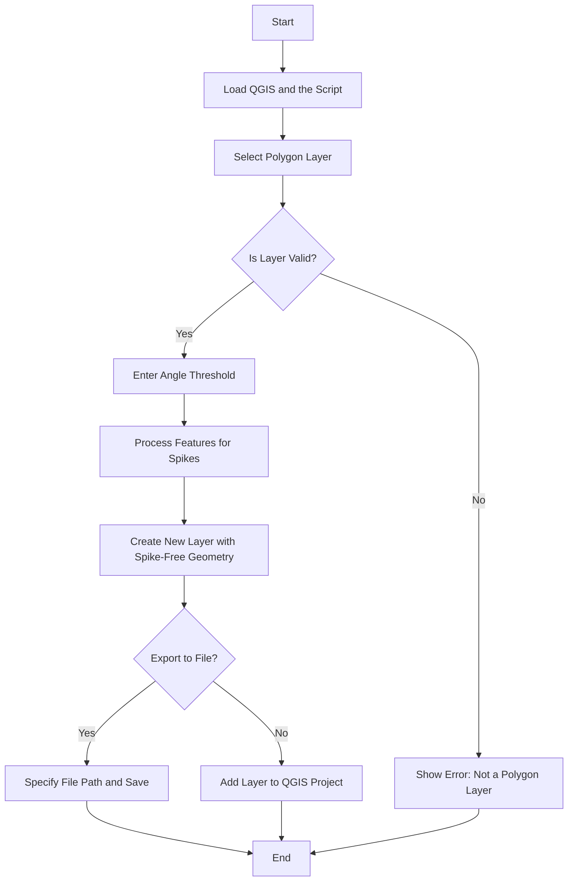

### Explanation of the Flow Diagram

- **Start**: The process begins.
- **Load QGIS and the Script**: The user opens QGIS and loads the `unspike.py` script.
- **Select Polygon Layer**: The script prompts the user to select a polygon layer.
- **Is Layer Valid?**: The script checks if the selected layer is a polygon or multipolygon.
  - **No**: If the layer is not valid, an error message is shown, and the process ends.
  - **Yes**: If the layer is valid, the script proceeds.
- **Enter Angle Threshold**: The user is prompted to enter the angle threshold for spike detection.
- **Process Features for Spikes**: The script processes each feature in the layer to remove spikes.
- **Create New Layer with Spike-Free Geometry**: A new layer with the modified geometry is created.
- **Export to File?**: The script asks the user if they want to export the new layer to a file.
  - **Yes**: If the user chooses to export, they specify the file path and the layer is saved.
  - **No**: If the user chooses not to export, the new layer is added to the current QGIS project.
- **End**: The process ends.
